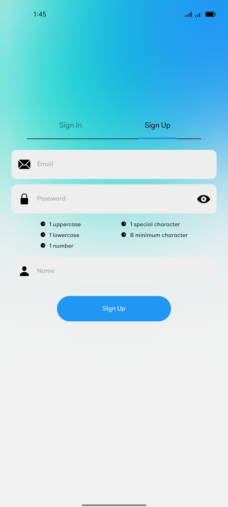
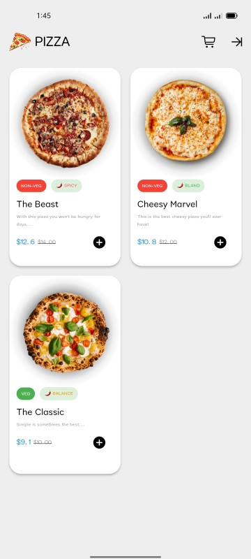
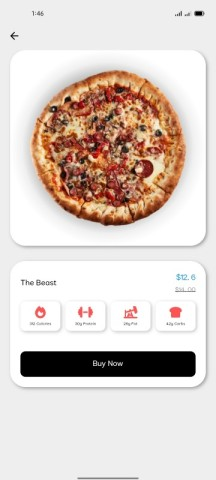

**Pizza World App**

Welcome to Pizza World, your ultimate destination for ordering delicious pizzas! This README will guide you through the features and functionalities of our pizza ordering application built using Flutter and Firebase.

## Preview

## Features

1. **Pizza Categories:** Explore a diverse range of pizza categories, from classic Margherita to gourmet BBQ Chicken.
2. **Menu:** Browse through our extensive menu featuring detailed descriptions, prices, and images of each pizza.
3. **Add to Cart:** Easily add your favorite pizzas to your cart with a simple tap.
4. **Customization:** Customize your pizzas by selecting toppings, crust types, and sizes to suit your taste.
5. **Order History:** Keep track of your past orders for quick reordering.
6. **Delivery:** Enjoy the convenience of doorstep delivery. Simply provide your address, and our delivery team will handle the rest.
7. **Payment Integration:** Securely pay for your orders using various payment methods supported by Firebase.
8. **User Authentication:** Create an account or log in securely to access personalized features such as order history and saved addresses.

## Technologies Used

- **Frontend:** Flutter
- **Backend:** Firebase (Firestore, Authentication)
- **Payment Integration:** Firebase Payment (or your preferred payment gateway)

## License

This project is licensed under the MIT License - see the [LICENSE](LICENSE) file for details.
